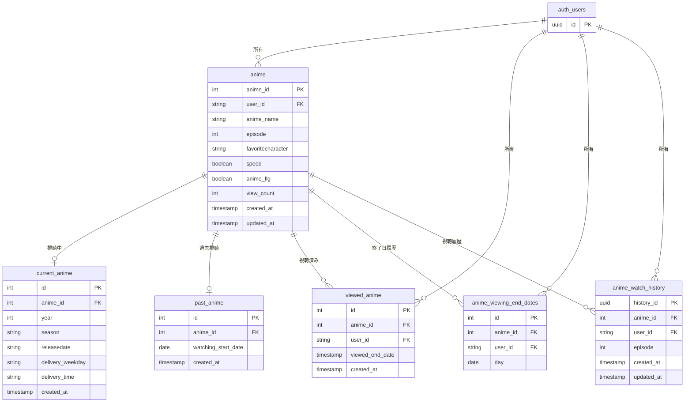

# anime-management

アニメ・ドラマ視聴管理アプリケーション - Supabaseを使用したフロントエンド実装

## 概要

このアプリケーションは、アニメ・ドラマの視聴状況を管理するためのウェブアプリケーションです。ユーザーは視聴中の作品、過去に視聴した作品、視聴済みの作品を管理することができます。Supabaseをバックエンドとして使用し、Next.jsとReactで構築されています。

## 主な機能

- **ユーザー認証**: Supabaseの認証機能を使用したログイン/ログアウト
- **作品登録**: アニメ・ドラマの登録（今期／過去の作品、種別、倍速フラグ、お気に入りキャラクター設定）
- **現在作品管理**: 視聴中のアニメ・ドラマを配信曜日・時間順に一覧表示。話数カウント、視聴完了・削除が可能。放送済み話数に対して視聴が遅れている場合はタイトルを赤くハイライト表示
- **過去作品管理**: 過去のアニメ・ドラマの話数管理、視聴完了への移行
- **視聴済み作品管理**: 視聴完了したアニメ・ドラマの一覧管理
- **日別視聴履歴**: 日付を指定して、その日に視聴した話数と視聴日時を一覧表示
- **年別視聴統計**: 年ごとに完走したアニメ・ドラマの本数を集計して表示

## 技術スタック

- **フロントエンド**: Next.js 15.1.7, React 19, TypeScript
- **スタイリング**: TailwindCSS
- **バックエンド**: Supabase (PostgreSQL, 認証, ストレージ)
- **コンテナ化**: Docker, Docker Compose

## インフラ構成

- AWS S3 による静的ホスティング（IP制限付き）
- CloudFormation でインフラをコード管理
- GitHub Actions で `app/` や `cloudformation/` への変更を自動デプロイ

## ER図

